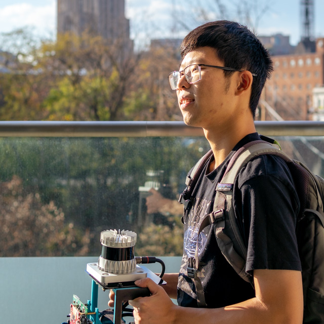
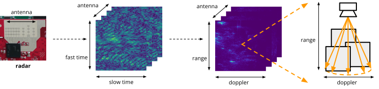

---
hide:
- navigation
---

# Tianshu Huang

</img>

I am a PhD student co-advised by [Anthony Rowe][?] and [Carlee Joe-Wong][?] at the Department of [Electrical and Computer Engineering](https://www.ece.cmu.edu/) at Carnegie Mellon University. I'm interested in learning for cyber-physical systems &mdash; applying machine learning to systems in ways that leverage both data-driven learning techniques and a low-level understanding of system properties &mdash; and taking a systems approach to applied machine learning.

Previously, I obtained my B.S. in Electrical Engineering at the University of Texas at Austin in May 2021. During my time at UT, I also worked on Learning to Optimize with [Atlas Wang][?].

Please contact me at <a href="mailto:tianshu2@andrew.cmu.edu">tianshu2@andrew.cmu.edu</a>.
You can find my GitHub page [here](https://github.com/thetianshuhuang); I also have a <a href="photography.html">photography site</a>.

## Research

My past and current work spans a wide range of topics in machine learning, including large transformer models (ICCV '25), statistical learning (MLSys '25), NeRF-style neural-implicit inverse rendering (CVPR Oral '24), and meta-learning (ICLR '22). I also actively support systems researchers by providing machine learning, statistics, and data science expertise (OOPSLA '25, RTAS '25, EuroSys '25), while also supporting machine learning researchers working with real-world sensors and systems.

Currently, I'm focused on rapidly scaling and commercializing my recent work on creating foundational models for radar via a technology transfer collaboration with Robert Bosch GmbH, a leading automotive radar manufacturer.

??? radar "**Machine Learning for Radar**"

    Radars are an ideal complement to cameras for applications such as autonomous driving: both are inexpensive, solid-state sensors, with cameras boasting fine angular resolution and radars providing depth resolution and robustness to adverse conditions. Unfortunately, unlike visual images or Lidar points, radar data are harder to interpret, and lack a large body of existing research. In this project, my goal is to develop machine learning-based methods to interpret radar data both spatially and semantically, potentially replacing Lidar as the primary means of 3D perception in robotics and beyond. 

    { width="1000" }

??? wasm "**Learning for Distributed Systems**"

    Recent advances in lightweight, bytecode-based virtualization &mdash; WebAssembly &mdash; raise the possibility of flexibly executing distributed programs in heterogeneous environments. While this promises substantial opportunity for optimizing over static, homogenous deployments, exploiting this opportunity requires mastering key building blocks for managing distributed systems. Along with my collaborators, I explore key concerns including orchestration, performance analysis, as well as debugging and anomaly detection. My approach emphasizes going beyond black-box approaches (in both a statistical and a systems sense) using techniques like instrumentation injection and statistical machine learning approaches. 

    { width="1000" }

## Publications

::: publications

## Talks

- [**Interference-aware Edge Runtime Prediction with Conformal Matrix Completion**](http://localhost:8000/resources/pitot_slides.pdf)
 
MLSys 2025 Conference Talk

- **The Radar Spectrum 2.0**
 
2025 Signal Processing Colloquium @ Bosch Research

- **Towards Foundational Models for mmWave Radar**
 
Invited Talks @ Bosch Research & Bosch Mobility, January, February, June 2025

- **Grey-Box Program Analysis: Runtime Prediction and Beyond**
 
Reliable Distributed Systems Tech Colloquium @ Bosch Research, October 2024

- **DART: Implicit Doppler Tomography for Radar Novel View Synthesis**
 
CVPR 2024 Main Conference Oral Presentation

- **Leveraging Wasm instrumentation**
 
*With [Arjun Ramesh][?]*
 
[WebAssembly Research Day 2023](https://www.cs.cmu.edu/~wasm/wasm-research-day-2023.html)

- **Giving the Cloud an Edge with WebAssembly**
 
*With [Arjun Ramesh][?]*
 
[WebAssembly Research Day 2022](http://www.cs.cmu.edu/~wasm/wasm-research-day-2022.html)

## Awards

2023-2024 Academic Year | **Prabhu and Poonam Goel Graduate Fellowship**
 
*Awarded to one student in the ECE department each academic year.*

Spring 2023 | **ECE Department Recognition Award for Exemplary Qualifying Exam Performance**
 
*Recognized by CMU ECE faculty for exemplary Ph.D. qualifying examination performance. This distinction was awarded by faculty vote to select students within the top 10% of Ph.D. student examinees.*
*This award is typically given to no more than one student each semester.*

Fall 2021 - Spring 2024 | **ARCS Pittsburgh Chapter Scholar**
 
*$15,000 award (over 3 years) for one student nominated by each participating department.*

Fall 2017 - Spring 2021 | **Virginia & Ernest Cockrell, Jr. Scholarship in Engineering**
 
*$48,000 award (over 4 years) for undergraduate students admitted to the ECE Honors program.*

## Students

**Zhaowei Zhang (Undergraduate)**, Spring 2024 &mdash;
 
In progress: Radar Compression

**Quentin Oschatz (Masters)**, Spring 2023 &mdash; Summer 2024
 
&xrarr; PhD (Carnegie Mellon University, Electrical and Computer Engineering)

**Hanke Chen (Undergraduate)**, Summer 2022 &mdash; Summer 2023
 
&xrarr; Startup (Neural Radiance Fields / 3D synthesis)

## Teaching

April 2024 | Guest Lecture: **[Machine Learning + Edge](resources/guest_lecture_machine_learning2.pdf)**
 
*CMU 18-649 Distributed Embedded Systems*

Spring 2024 | TA: **18-661 Introduction to Machine Learning**
 
Lecture: [SVM I (SVM, Hinge Loss, Max-Margin)](resources/18661_svm_i.pdf)
 
Lecture: [SVM II (Duality, Kernel Trick, What Happened to SVMs?)](resources/18661_svm_ii.pdf)

February 2023 | Guest Lecture: **[Federated Learning](resources/guest_lecture_federated_learning.pdf)**
 
*Duke ECE/COMPSCI 654 Edge Computing*

November 2022 | Guest Lecture: **[Machine Learning + Edge](resources/guest_lecture_machine_learning.pdf)**
 
*CMU 18-649 Distributed Embedded Systems*

Spring 2022 | TA: **18-661 Introduction to Machine Learning**
 
Lecture: [Better and Faster Python](resources/18661_python.pdf)
 
Lecture: [Pytorch (and how we got here)](resources/18661_pytorch.pdf)

Fall 2020 - Spring 2021 | TA: **EE 351k Probability, Statistics and Random Processes**
 
*UT Austin (as undergraduate TA)*

## Service

- **CVPR 2025 Outstanding Reviewer** &mdash; [Awarded to 5.6% of Reviewers](https://media.eventhosts.cc/Conferences/CVPR2025/CVPR_main_conf_2025.pdf)

- **Reviewer** &mdash; for CVPR 2025, ICML 2022, NeurIPS 2022

- **Faculty Search Student Council Co-Chair** &mdash; for the CMU ECE department 2024 and 2025 hiring cycles

- **Technical Program Committee Member** &mdash; for the Cross-Community Federated Learning Workshop @ MLSys 2022

- **Peer Mentor** &mdash; as part of the CMU ECE Peer Mentor Program, 2023-2024

