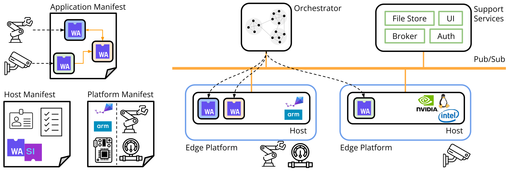

---
hide:
- navigation
---

</img>

My past and current work spans a wide range of topics in machine learning, including large transformer models ([ICCV '25](#grt)), statistical learning ([MLSys '25](#pitot)), NeRF-style neural-implicit inverse rendering ([CVPR '24](#dart)), and meta-learning ([ICLR '22](#l2o)). I also actively support systems researchers by providing machine learning, statistics, and data science expertise ([OOPSLA '25](#beanstalk), [RTAS '25](#silverline), [EuroSys '25](#wali)), while also supporting machine learning researchers working with real-world sensors and systems.

Currently, I'm focused on rapidly scaling and commercializing my recent work on creating foundational models for radar via a technology transfer collaboration with Robert Bosch GmbH, a leading automotive radar manufacturer.

!!! abstract "PhD Thesis: Learning on Spectrum for Radar-Enabled 3D Perception"

    > 3D perception systems should use learning-based methods on unfiltered 4D spectra. When fused with cameras and trained at scale, spectrum-based systems will far outperform classical signal processing-based methods, and match the quality of lidar-based systems even when using only low-cost single-chip radars.

    *Committee: [Anthony Rowe][?], [Carlee Joe-Wong][?], [Deva Ramanan][?], [Zico Kolter][?]*

???+ radar "**Machine Learning for Radar**"

    Radars are an ideal complement to cameras for applications such as autonomous driving: both are inexpensive, solid-state sensors, with cameras boasting fine angular resolution and radars providing depth resolution and robustness to adverse conditions. Unfortunately, unlike visual images or Lidar points, radar data are harder to interpret, and lack a large body of existing research. In this project, my goal is to develop machine learning-based methods to interpret radar data both spatially and semantically, potentially replacing Lidar as the primary means of 3D perception in robotics and beyond. 

    { width="1000" }

???+ wasm "**Learning for Distributed Systems**"

    Recent advances in lightweight, bytecode-based virtualization &mdash; WebAssembly &mdash; raise the possibility of flexibly executing distributed programs in heterogeneous environments. While this promises substantial opportunity for optimizing over static, homogenous deployments, exploiting this opportunity requires mastering key building blocks for managing distributed systems. Along with my collaborators, I explore key concerns including orchestration, performance analysis, as well as debugging and anomaly detection. My approach emphasizes going beyond black-box approaches (in both a statistical and a systems sense) using techniques like instrumentation injection and statistical machine learning approaches. 

    { width="1000" }

## Publications

::: publications

## Talks

- [**Interference-aware Edge Runtime Prediction with Conformal Matrix Completion**](http://localhost:8000/resources/pitot_slides.pdf)
 
MLSys 2025 Conference Talk

- **The Radar Spectrum 2.0**
 
2025 Signal Processing Colloquium @ Bosch Research

- **Towards Foundational Models for mmWave Radar**
 
Invited Talks @ Bosch Research & Bosch Mobility, January, February, June 2025

- **Grey-Box Program Analysis: Runtime Prediction and Beyond**
 
Reliable Distributed Systems Tech Colloquium @ Bosch Research, October 2024

- **DART: Implicit Doppler Tomography for Radar Novel View Synthesis**
 
CVPR 2024 Main Conference Oral Presentation

- **Leveraging Wasm instrumentation**
 
*With [Arjun Ramesh][?]*
 
[WebAssembly Research Day 2023](https://www.cs.cmu.edu/~wasm/wasm-research-day-2023.html)

- **Giving the Cloud an Edge with WebAssembly**
 
*With [Arjun Ramesh][?]*
 
[WebAssembly Research Day 2022](http://www.cs.cmu.edu/~wasm/wasm-research-day-2022.html)

